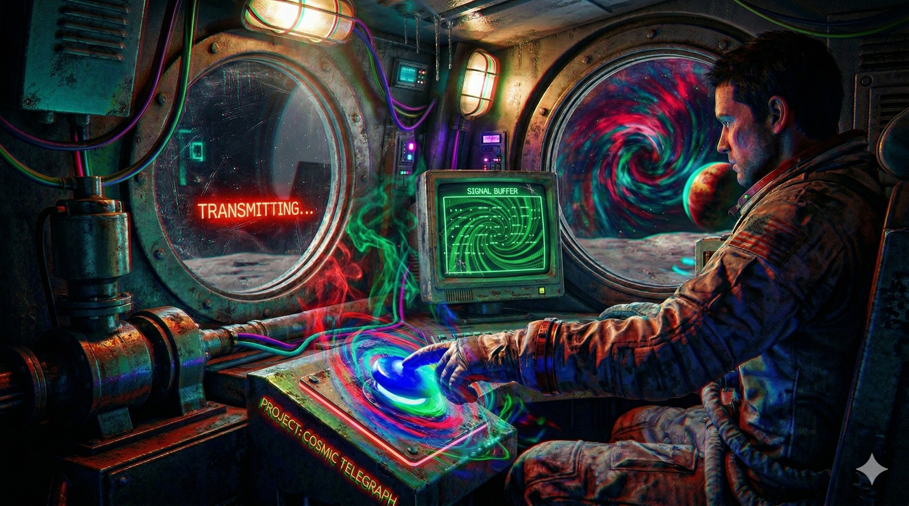

This is a Morse Code MMO.

234 Zones. A letter and a speed number.

For example: A2, K4, V9, F3, T8.

Lower numbers mean slower, more forgiving.

Higher numbers mean closer to real speed.

Each zone has its own theme.

The zones remember the words.

You might encounter other users.

Each user has a personality.

---

A game and a telegraph system.
An interface for encounters, learning, hints, narrative, drama, triggers, ominous words, zones, contacts.

It's a high effort and low throughput communication platform. This mode of communication filters a lot of boring superflous messages while making every formed word have some weight.

You can visit and lurk here and maybe you'll encounter somebody online, and you can use this to practice morse code.

---

## Actions

Can be set up to run system commands on specific zones when using certain words.

This is done in `actions.js`:

Actions are registered like this:

```js
Actions.register(`j4`, `hi`, () => {
  Actions.execute_command(`notify-send hello`)
})
```

This means you could use this as a semi-secure interface to access or trigger things.