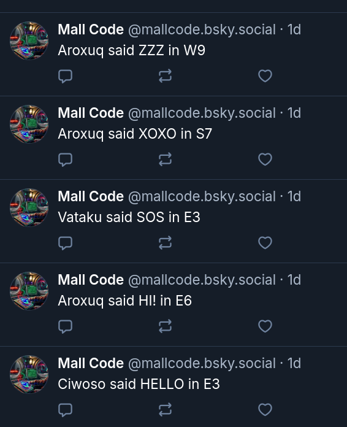

This is a Morse Code MMO.

234 Zones. A letter and a speed number.

For example: A2, K4, V9, F3, T8.

Lower numbers mean slower, more forgiving.

Higher numbers mean closer to real speed.

Each zone has its own theme.

The zones remember the words.

You might encounter other users.

Each user has a personality.

---

A game and a telegraph system.
An interface for encounters, learning, hints, narrative, drama, triggers, ominous words, zones, contacts.

It's a high effort and low throughput communication platform. This mode of communication filters a lot of boring superflous messages while making every formed word have some weight.

You can visit and lurk here and maybe you'll encounter somebody online, and you can use this to practice morse code.

---

## Actions

Can be set up to run system commands on specific zones when using certain words.

This is done in `action_funcs.js`:

Actions are registered like this:

```js
// Register functions in action_funcs.js
// Optional argument objects include "lock"
// lock means how many seconds to block exact commands
// To avoid spam. Default is 10 seconds

Actions.register_word(`j4`, `hi`, (ws, zone, value) => {
  Actions.execute_command(`notify-send hello`)
})

Actions.register_code(`k3`, `..-..`, (ws, zone, value) => {
  Actions.execute_command(`unlock computer`)
})

Actions.register_word(`any`, `rec`, (ws, zone, value) => {
  Actions.execute_command(`capture video`)
}, {lock: 60})

// This registers a function that runs on any word event
Actions.register_global_word((ws, zone, value) => {
  Actions.execute_command(`notify-send word`)
}, {lock: 3})

// This registers a function that runs on any code event
Actions.register_global_code((ws, zone, value) => {
  Actions.execute_command(`notify-send code`)
}, {lock: 3})
```

This means you could use this as a semi-secure interface to access or trigger things.

---

Mall Code can post automatically to `Bluesky`:



To do this, simply create `post_words.txt` and add words to it.

Or copy the default list:

`cat post_words_default.txt > post_words.txt`

---

There's an anti-spam system to stop abuse.

---


Invest in `Mall Code` to put a `network` enabled morse code `communication` system in all `living rooms` and `airplanes`.

---

Read some [theories](theory.md).

---

## Installation

`git clone this_repo`

`npm install`

Run `server/markov.js` to create the echo corpus.

Start it with `run.sh`.

Then make a proper `pm2` config for it.

The main file is `server/server.js`.