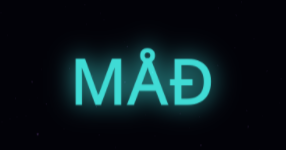
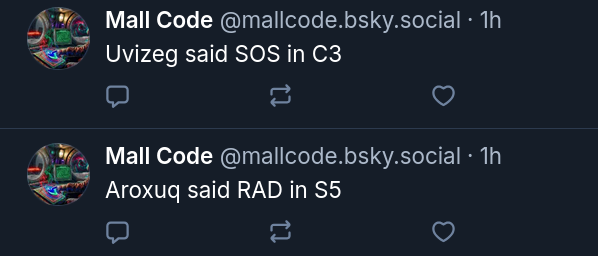

`Mall Code` is a high effort and low throughput communication system.

In other words, there is effort and time required to produce a message.

Since time is part of the equation, any letter or word sent will need the appropriate durations, gaps, delays, to make it through. It won't be sent in milliseconds like with normal text chat systems.

This means that even if a user installs an extension to type the morse code for them or use a program to do this automatically, time will still be involved. Bots wouldn't be able to send or read thousands of words in seconds, instead they read one word.

---

The morse code communication allows users to show their skill level.

Skilled users will type faster, with less errors. They could be found in the higher speed zones.

More skilled users can incorporate obscure characters apart from a-z to adorn their messages.

So `Mall Code` allows gauging cognitive abilities while simply engaging in communication.

For instance you might want to sign your message with a nice name like:

---

Being a harder and slower mode of communication filters out types of communication users might not desire at that point, like low effort hate, violence, confusion, hostility, or time-wasting messages.

And it gives cleanly produced words more weight and meaning.

---

Connecting this to a social media system, like `Bluesky`, allows users to broadcast messages that could have meaning to other users.

Not all words are broadcasted, to avoid allowing users from sending problematic words, instead some words are manually whitelisted by adding them to a text file.

The posts have 2 components to consider, the code word, and the zone.

It can be a call to gather at that specific zone for a meeting.

Or it could be a codeword only members of an organized community can understand.

Or it can just be random, maybe funny, meaningless manifestation of life.

---

Banning this system would be absurd since it's banning one of the slowest and hardest forms of human communication. It would make it clear a state is desperate and has no regard for its citizens.

---

It can be used as an interface to access or create things.

For instance, it can be programmed so that certain words or sequences open up doors, unlock computers, play messages, or any other action available.

There is already a system to register actions easily.

It is a semi-secure interface since it's not really concealed, it just requires some morse code skill and knowing certain keywords.

The keywords can be zone dependent, so for instance opening doors can only work if you are in the K4 zone.

It can be a way to provide an interface to fullfill wishes while having a certain friction, to not making it entirely easy to trigger actions, as a way to regulate actions.

---

If connected to a universal system, organizations can listen to specific zones for messages. For instance they might be interested in `SOS` messages, either on certain zones or globally. Maybe to provide assistance.

---

Special hardware can allow users to send morse code messages. For instance, a user might have a special network-enabled pen, or any object they can tap, and send something specific, maybe to a certain zone. This can be useful in emergency scenarios.

---

Since time is involved, this can't be easily used for computer-to-computer communication. Computers can send messages to each other in big volumes, very quickly. But in this system they would be subjected to the same constraints humans have. So either computers would have to end behaving more human here, or there would be no computers, making it a human-mostly zone.

---

Streams and poll systems can use this as a way to gauge for support on certain things or events.

For instance they could check the `Bluesky` posts to check for codewords that would be relevant in the moment.

Streamers and organizations could start taking over some zones, or become associated with them.

---

This can be connected to an `imaginarium` to build structures in zones.

For instance if a user is able to write `cemetery` in `K6`, then an AI system would build a cemetery 3D structre in that zone in some sort of walkable video game, maybe a `VR` experience.

This allows users to have a say into what exists or what is happening in certain zones, limited by their initiative, and being able to write the words in time.

A user might be able to tap `coke` in the zone, making them now eligible to receive a nice cold `coca cola` drink.

---

Can be used for security purposes. Each zone meaning a certain room or event.

Participants use the beeps as pings or signals. And the words would have meaning:

For instance typing "hot" in M9 might mean something is happening there.

---

Our taps could be considered to be connected and felt by forces we can't see all the time.

`Morse Code` itself, being an old tech by now, could have found its way into systems that are actively listening.

Doing and `SOS` on a surface, without any tech, might trigger a vessel to appear in the sky.

So I'd advice treating those with some sort of measure.

Now consider what that means in an online multiplayer morse code system.
