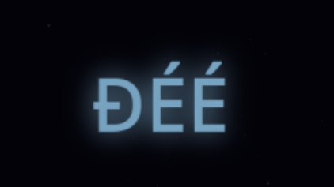

`Mall Code` is a high effort and low throughput communication system.

In other words, there is effort and time required to produce a message.

Since time is part of the equation, any letter or word sent will need the appropriate durations, gaps, delays, to make it through. It won't be sent in milliseconds like with normal text chat systems.

This means that even if a player installs an extension to type the morse code for them or use a program to do this automatically, time will still be involved. Bots wouldn't be able to send or read thousands of words in seconds, instead they read one word.

---

The morse code communication allows players to show their skill level.

Skilled players will type faster, with less errors. They could be found in the higher speed zones.

More skilled players can incorporate obscure characters apart from a-z to adorn their messages.

So `Mall Code` allows to gauge cognitive abilities while simply engaging in communication.

For instance you might want to sign your message with a nice name like:

---